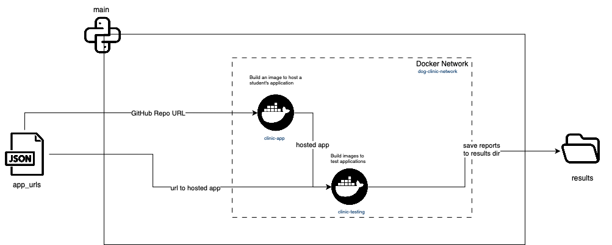

# Тестирование микросервисов для ветеринарной клиники
## Обзор

Этот репозиторий содержит инструмент для тестирования микросервисов, предназначенных для хранения и обновления информации о собаках в ветеринарной клинике. Эти микросервисы разработаны студентами в рамках домашних заданий по курсу "Инструменты промышленной разработки".

## Настройка и использование
Для работы скрипта необходимы следующие шаги:

1. Клонирование репозитория
```bash
git clone https://github.com/asvistunov/mobc-dog-clinic-testing.git
```
2. Установка зависимостей
```bash
pip3 install -r requirements.txt
```
> Скрипт написан на python3.10
1. Конфигурация

Создайте файл `app_urls.json` со следующей структурой:
```json
{
  "students_apps": [
    // Структура для каждого студента
    {
      "student_id": "student_1", // ID студнта
      "github": "string", // Ссылка на GitHub-репозиторий
      "url": "string" // Ссылка на развернутый сервис
    },
    {
      "student_id": "student_2", // ID студнта
      "github": "string", // Ссылка на GitHub-репозиторий
      "url": "string" // Ссылка на развернутый сервис
    },
    // Другие записи студентов
  ]
}
```
Пример такого файла доступен в репозитории.
> :warning: Убедитесь, что ссылка на развернутый сервис заканчивается на `/`. Например, используйте `https://example.com/`, а не `https://example.com`.

4. Настройка Docker  
Включите опцию `Allow the default Docker socket to be used` в настройках Docker Desktop. Подробнее см. [здесь](https://github.com/docker/desktop-linux/issues/20#issuecomment-1519530462).

5. Запуск тестов
```bash
python3 test_api.py
```

## Процесс тестирования
Процесс тестирования изображен на диаграмме ниже:



1. Создание единой для всех контейнеров сеть `dog-clinic-network`
2. Сборка образов для тестирования из `docker/app_testing`  
Образ содержит скрипт для тестирования приложений на соответствие Swagger спецификации. Подробная логика тестов находится в `docker/app-testing/api_testing.py`
> :warning: Тесты разработаны на основе YAML спецификации, предоставленной в домашнем задании. Это значит, что любые разрешенные изменения в структуре микросервиса могут исказить результаты тестирования.
3. Сборка и запуск контейнера из образа `docker/app_hosting`, содержащего микросервис студента.
> :warning: Предполагается, что репозиторий имеет "плоскую структуру", файл для запуска приложения называется `main.py` и зависимости называются `requirements.txt`. Пример такой структуры:
> ```bash
> .
> +-- .gitignore
> +-- LICENSE
> +-- README.md
> +-- main.py
> +-- requirements.txt
> ```
4. Запуск контейнеров тестирования и запись отчетов в папку `results`.  

Процесс повторяется для каждого микросервиса, описанного в `app_urls.json`.

Структура папки `results/` после работы скрипта:
```bash
.
+-- results
|   +-- student_1
|   |   +-- github-report.json
|   |   +-- url-report.json
|   +-- student_2 
|   |   +-- github-report.json
|   |   +-- url-report.json
```
Отчеты в формате JSON содержат детальную информацию о результатах тестов. Детальность информации сохранена для упрощения проверки конкретный тест-кейсов.

## Полезные ссылки
* [Schemathesis](https://schemathesis.readthedocs.io/en/stable/): библиотека для тестирования соответствия микросервиса спецификации Swagger.
* [Hypothesis](https://hypothesis.readthedocs.io/en/latest/): основа для Schemathesis, поддерживает `property-based testing`.
* [Docker SDK](https://docker-py.readthedocs.io): библиотека для управления Docker через Python.
  